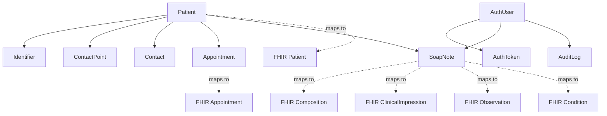

# FHIR SOAP Record MVP

This repository is a study-oriented FHIR project and a usable MVP for a private clinical office workflow while OpenMRS is not yet ready in Portuguese for this specific use case.

The application is intentionally narrow:

- token-based authentication
- patient registry and editing
- read-only agenda
- SOAP note registration
- FHIR-oriented API
- FHIR Bundle import
- Swagger/OpenAPI docs
- Docker-based execution

The implementation stays as a single full-stack monolith and follows `YAGNI`, `DRY`, and `KISS`.

## Stack and Architecture

- React Router v7 in framework mode
- React + TypeScript
- Node.js
- Prisma Client
- MySQL
- Tailwind CSS
- OpenAPI + Swagger UI
- Docker Compose

Operational rules in this codebase:

- frontend and backend run in the same Node application
- web routes and API routes are served by the same runtime
- Prisma is the typed ORM client, but Prisma migrations are not treated as the authoritative deployment mechanism for the shared database
- the existing shared schema remains the source of truth
- internal persistence stays workflow-oriented, while the API layer exposes FHIR-aligned resources

## Entity and FHIR Diagram



## Local Run

1. Install dependencies.

```bash
pnpm install
```

2. Create environment variables.

```bash
cp .env.example .env
```

3. Generate Prisma Client.

```bash
pnpm prisma:generate
```

4. Point `DATABASE_URL` at your MySQL instance.

For a standalone local database, use the schema in [sql/mysql/full-schema.sql](/Users/filipelopes/Desktop/Development/fhir-soap-record/sql/mysql/full-schema.sql).

For an existing shared database that already contains `Patient`, `Contact`, `ContactPoint`, `Identifier`, `Appointment`, and `GeneralSetting`, apply only [sql/mysql/mvp-additions.sql](/Users/filipelopes/Desktop/Development/fhir-soap-record/sql/mysql/mvp-additions.sql) and keep the existing data model in place.

5. Start the application.

```bash
pnpm dev
```

## Docker Run

Use Docker Compose for a full local stack with MySQL and the Node monolith:

```bash
docker compose up --build
```

Compose uses [sql/mysql/full-schema.sql](/Users/filipelopes/Desktop/Development/fhir-soap-record/sql/mysql/full-schema.sql) to initialize the local database.

## Environment Variables

- `DATABASE_URL`: MySQL connection string used by Prisma Client
- `APP_URL`: external base URL used in generated docs and examples
- `PORT`: Node application port
- `COOKIE_NAME`: auth cookie name for web login

## Prisma Client Usage

This project uses Prisma Client for reads, writes, and typing, but it does not assume ownership of the full lifecycle of the shared database.

Practical rule:

- run `pnpm prisma:generate` after schema changes
- do not assume `prisma migrate deploy` is the correct deployment path for the shared schema
- use the SQL files in `sql/mysql/` to bootstrap the standalone database or add only the MVP tables to a shared database

## Create a User and Token

Create the first clinical user and token with the CLI:

```bash
pnpm create:user -- --fullName "Dra. Ana Silva" --crm "12345" --crmUf "BA"
```

The token is shown once at creation time. Store it safely and use the same token for:

- login in the web interface
- `Authorization: Bearer <token>` on API requests

## Access Points

With the default local configuration:

- web app: `http://localhost:3000/login`
- Swagger UI: `http://localhost:3000/docs`
- OpenAPI JSON: `http://localhost:3000/openapi.json`
- FHIR metadata: `http://localhost:3000/fhir/metadata`
- FHIR patient search: `http://localhost:3000/fhir/Patient`
- FHIR Bundle import: `POST http://localhost:3000/fhir`

## Import Notes

The FHIR import endpoint accepts a focused subset of `Bundle` payloads for:

- `Patient`
- `Composition`
- referenced `Encounter`, `Observation`, `Condition`, and `ClinicalImpression` when needed to derive SOAP content

For import, the `Patient` can include optional fields such as `identifier`, `telecom`, and `contact`.

For SOAP import, the `Composition` can provide the encounter date in either of these ways:

- directly in `Composition.date`
- indirectly through `Encounter.period.start` referenced by `Composition.encounter`

## Feature Scope

Implemented MVP screens:

- token login
- patient list with search
- patient create/edit
- read-only agenda based on `Appointment`
- SOAP page with patient header and collapsed previous-records section

Implemented API surface:

- `GET /fhir/metadata`
- patient FHIR routes
- appointment FHIR routes
- SOAP-derived FHIR routes through `Composition`, `Encounter`, `Observation`, `Condition`, and `ClinicalImpression`
- `POST /fhir`
- `GET /openapi.json`
- `GET /docs`
