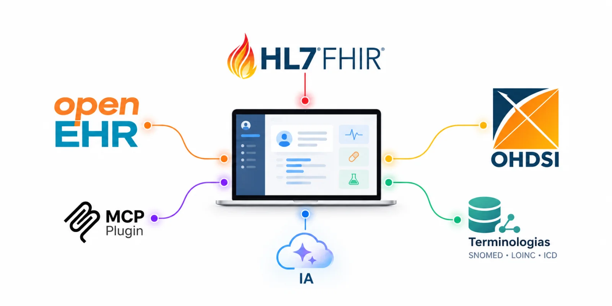
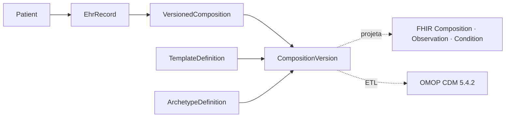

<p align="center">
  
</p>

<h1 align="center">soap-ehr</h1>

<p align="center">
  <strong>Prontuário pessoal compacto: registro clínico versionado, API FHIR e projeção analítica OMOP.</strong>
</p>

<p align="center">
  
  
  
  
  
</p>

`soap-ehr` é um monolito full-stack enxuto para registrar atendimentos (SOAP e notas narrativas) e estudar, na prática, três padrões de dados em saúde que se complementam.

> **Status:** MVP funcional, em evolução. Não é um servidor openEHR de conformidade completa (sem ADL/OPT, AQL ou Reference Model completo).

> [!TIP]
> **Precisa de algo mais avançado?** Use o prontuário aberto com maior comunidade do mundo: **[OpenMRS](https://github.com/openmrs)** — open source e gratuito.

## Por que existe

- **openEHR-inspired:** arquétipos, templates e composições versionadas são a fonte canônica do conteúdo clínico.
- **FHIR:** superfície de interoperabilidade (API e importação de `Bundle`).
- **OMOP CDM 5.4.2:** projeção analítica derivada, somente leitura, no mesmo PostgreSQL.
- **Simples por escolha:** um único app Node, seguindo YAGNI, DRY e KISS.

## Como se encaixa


```mermaid
flowchart LR
  Patient --> EhrRecord --> VersionedComposition --> CompositionVersion
  TemplateDefinition --> CompositionVersion
  ArchetypeDefinition --> CompositionVersion
  CompositionVersion -. projeta .-> FHIR[FHIR Composition · Observation · Condition]
  CompositionVersion -. ETL .-> OMOP[OMOP CDM 5.4.2]
```

## O que existe hoje

| Capacidade | Comportamento |
| --- | --- |
| **Autenticação** | Login por token, o mesmo usado na API (`Bearer`). |
| **Pacientes** | Cadastro, busca e edição. |
| **Agenda** | Baseada em `Appointment`, com atendimento direto para o registro clínico. |
| **Registro clínico** | Notas SOAP e narrativas, rascunho local criptografado e histórico de registros anteriores. |
| **API FHIR** | `Patient`, `Appointment`, `Composition`, `Encounter`, `Observation`, `Condition`, `ClinicalImpression`, `POST /fhir` (Bundle). |
| **Docs da API** | Swagger UI em `/docs` e OpenAPI em `/openapi.json`. |
| **Interface** | Português do Brasil (pt-BR) por padrão, via i18next. |

## Início rápido

Requisitos: Node.js 20+ e pnpm 10.

```bash
pnpm install
cp .env.example .env
pnpm prisma:generate
pnpm prisma:migrate:deploy
pnpm create:user      # gera o token de acesso (exibido uma única vez)
pnpm dev
```

Ou com Docker (PostgreSQL + app):

```bash
docker compose -f compose.yml -f compose.dev.yml up --build
```

Acesso local: app em `http://localhost:3000/login`, Swagger em `/docs`, FHIR em `/fhir/metadata`.

## Stack

React Router v7 · React 19 · TypeScript · Prisma · PostgreSQL 17 · Tailwind CSS · OpenAPI/Swagger UI · i18next · Docker Compose

## Documentação

- [Guia de desenvolvimento e operação](docs/desenvolvimento.md): variáveis de ambiente, Docker, Prisma, importação FHIR
- [Arquitetura V2](docs/architecture-v2.md)
- [Projeção OMOP](docs/omop.md)
- [Migração V1 → V2](docs/migration/README.md)
- [Requisitos SBIS S-RES 5.2](docs/S_RES_5_2.md) e [matriz de conformidade](docs/S_RES_5_2_CONFORME.md)

## Autor

Desenvolvido por [Filipe Lopes](https://link.orango.io/Iyqdm), MD.
